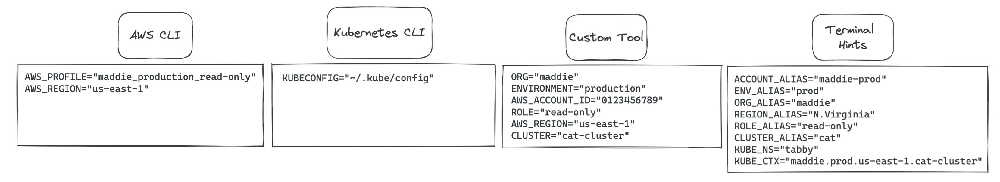

# ctxman

*A CLI context manager. Name inspired by [envman](https://github.com/bitrise-io/envman).*

# Overview

Most command line tools that I use on a daily basis determine the user’s desired destination for API calls to remote services based on environment variables. These variables are often referenced using the same key by multiple tools. For each of these CLI tools, users need to supply the required environment variables. Maintaining the same “context” across multiple tools with differing variable schemas, and switching between these contexts can quickly become tedious.



You may find yourself struggling to remember which account, org, project, region, cluster, or namespace you had exported in your previous terminal instance. You could implement some terminal hints to signal the selected context to yourself…


But this requires a lot of custom shell scripting to get working, and isn’t very easy to share across an organization.

Wouldn’t it be nice if all of your environment variables could be inferred from a simple, easy-to-read “context” alias that you only had to set up once?

## Goals

1. Export a set of environment variables from an easily configured context.
2. Enable use of multiple tools with the same context, despite

## Terminology

* **context** - an abstraction around a set of environments that define how you are able to interact with cloud resources through your command line
* **scope** - a single component of a context, for example an AWS REGION, which may or may not comprise the entire context.

# Usage
Assume the following config:
```yaml
scopes:
  default:
    environment:
      hooks:
        - kind: setEnv
          name: CTX_DEFAULT
          alwaysRun: true
contexts:
  work:
    scopes:
      default: 'work'
  home:
    scopes:
      default: 'work'
```


```sh
# Adds a block to your shell config (~/.zshconfig, etc.) to
# - enable ctxman to set environment variables
# - configure autocomplete
ctx setup zsh|powershell|fish|bash

# Edit your config file
ctx config edit

# View the current config yaml fil
ctx config view

# Wizard or flags
ctx create scope

# Generate all of your contexts based on the scopes you've defined
ctx generate/sync

# Create a new context using the wizard
ctx create context

# Create a context
ctx create context --workstream legacy --env prod --region us-west-2 --cluster eks-cluster

# Assume a context
ctx use legacy.prod.us-east-1.eks-cluster

# Auto-select an existing context using autofill/fzf/etc.
ctx

# List current scope name
ctx --current|-c

# List current scope along with all relevant environment variables
ctx --current|-c --vars|-v
legacy.prod.us-east-1.eks-cluster
WORKSTREAM=legacy
ENVIRONMENT=prod
REGION=us-east-1
CLUSTER=eks-cluster

# List all scopes
ctx list scopes

# Describe a scope
ctx describe scope legacy.prod.us-east-1.eks-cluster

# List all contexts
ctx list contexts
```

# TODO: 

- Syncing all contexts vs. assuming a context
- Generating new contexts based on your

# Development
Add to shell file:
```sh
# CTXMAN BEGIN
function ctxman_exe() { cd $HOME/Development/ctxman && go run cmd/main.go $@; }
function ctx() {
  local stdout
  # Save stdout to var (stderr is unaffected)
  stdout=$(ctxman_exe $@)
  # Print everything but the export lines
  echo $stdout | grep --invert-match -e '^export ' -e '^unset '
  # Execute the export lines
  export_statements=$(echo $stdout | grep -e '^export ' -e '^unset ')
  while IFS= read -r line ; do 
    eval $line; 
  done <<< "$export_statements"
}
# CTXMAN END
```
